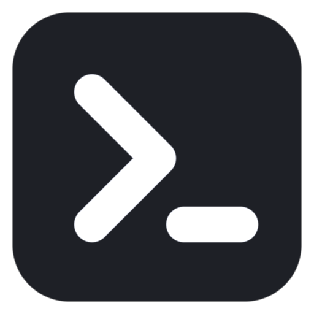

# DSH Desktop _(dsh-webapp)_

<p align="center">
  
</p>

[](https://github.com/RichardLitt/standard-readme)
[](https://github.com/auggie246/dsh-webapp/releases)
[](LICENSE)

Desktop shell for the DeepSeek Harness (DSH) web GUI: window, attach-or-spawn, Host bar, hide-to-bar, quit-kills-host.

DSH Desktop puts the [DeepSeek Harness](https://github.com/deepseek-ai/deepseek-harness) web GUI in a native desktop window, instead of a browser tab on localhost. It manages several Hosts through one Host bar, stays available from the Tray, and shows operating-system notifications.

The product and package are named `dsh-desktop`; the repository keeps its working name `dsh-webapp`. Both names refer to the same app.

> [!NOTE]
> DSH Desktop is prerelease software. The v0.3 packages are unsigned and use manual updates.

## Table of Contents

- [Install](#install)
- [Usage](#usage)
- [Features](#features)
- [Unsigned package warnings](#unsigned-package-warnings)
- [Support](#support)
- [Maintainers](#maintainers)
- [Contributing](#contributing)
- [License](#license)

## Install

### 1. Install `dsh`

DSH Desktop uses the separately published [`@deepseek-ai/dsh`](https://www.npmjs.com/package/@deepseek-ai/dsh) package.

```sh
npm install -g @deepseek-ai/dsh
```

### 2. Download DSH Desktop

Download the package for your platform from [GitHub Releases](https://github.com/auggie246/dsh-webapp/releases).

| Platform | Package |
| --- | --- |
| macOS 14 or later on Apple silicon | DMG |
| Windows x64 | Installer (`.exe`) or portable ZIP |
| Linux x64 | AppImage or Debian package (`.deb`) |

### 3. Open DSH Desktop

DSH Desktop uses attach-or-spawn. It attaches to an existing Host, or spawns one with the installed `dsh`.

If DSH Desktop cannot find `dsh`, its setup screen can retry detection or use an explicit path.

## Usage

Open DSH Desktop from your operating system's application launcher.

Press `Cmd+Shift+D` on macOS or `Ctrl+Shift+D` elsewhere to open the window. The same picker lives in the Tray menu.

Add each Host you manage with the "+" control on the Host bar. Right-click a Host to remove it.

If you prefer a plain browser tab for a session, the same GUI is one command away:

```sh
dsh web
```

## Features

- Manage several Hosts from one Host bar; right-click a Host to remove it (a spawned Host's process is stopped).
- Open the window with `Cmd+Shift+D` on macOS or `Ctrl+Shift+D` elsewhere by default.
- Keep the app's menu row out of the way — press `Alt` to reveal it (Linux and Windows).
- Keep DSH Desktop available after closing its window when the operating system provides a usable Tray.
- Receive notifications for Host events.
- Terminate every spawned Host when DSH Desktop quits.

## Unsigned package warnings

macOS Gatekeeper and Windows SmartScreen can warn about the unsigned packages.

Follow the [safe installation and checksum instructions](docs/release-install.md) before you override either warning.

## Support

[Report problems through GitHub Issues](https://github.com/auggie246/dsh-webapp/issues).

Include your platform, downloaded package name, and `dsh --version` output.

## Maintainers

[@auggie246](https://github.com/auggie246)

## Contributing

Development requires Node.js 22 and pnpm 11.7.0.

```sh
pnpm install --frozen-lockfile
pnpm start
```

Run the checks before you submit a change:

```sh
pnpm test
pnpm typecheck
```

## License

[MIT](LICENSE) © DSH Desktop contributors
